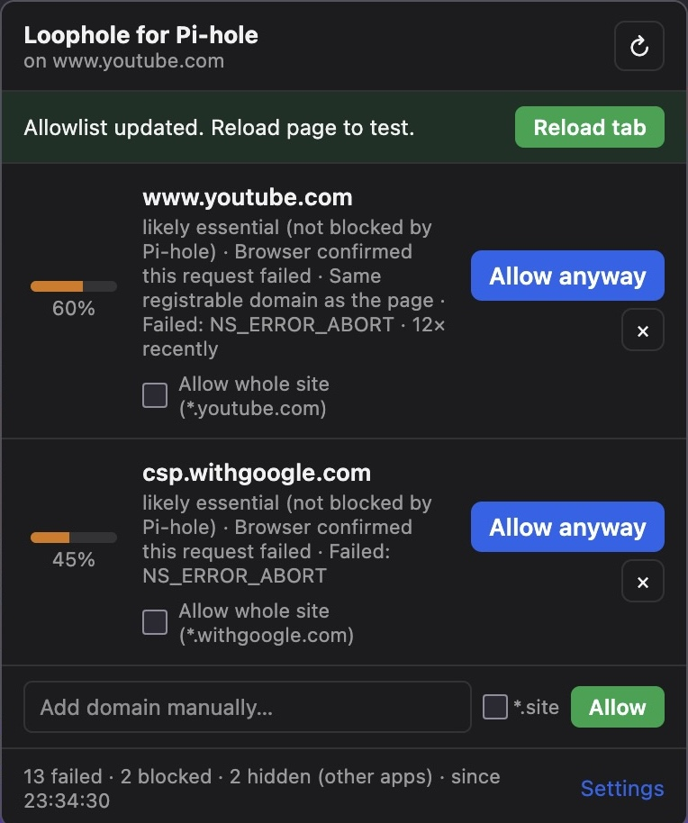
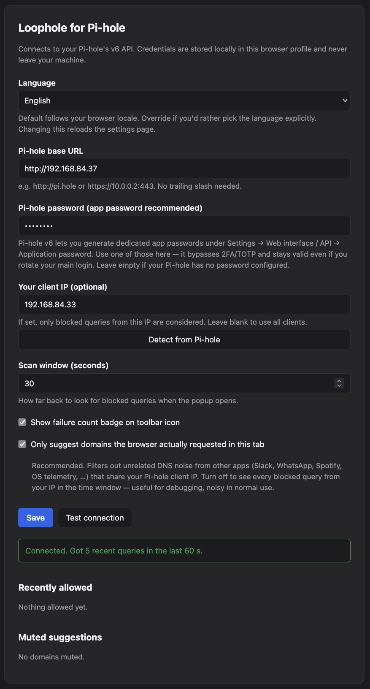
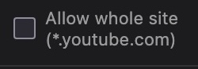
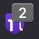

# Loophole for Pi-hole

> A Firefox extension that notices when a page looks broken because of Pi-hole
> — and tells you exactly which blocked domains to allow, ranked by how
> likely they are to fix it. One click instead of digging through the query log.
>
> *A loophole is a small opening in a wall. This extension makes those for you,
> in your Pi-hole, only where you need them.*

[](https://addons.mozilla.org/firefox/addon/loophole-for-pi-hole/)
[](LICENSE)


## Screenshots

<table>
<tr>
<td width="50%" valign="top">



**The popup.** Confidence-ranked suggestions with one-click *Allow*. The
footer shows how many blocked queries were filtered out as cross-app noise.

</td>
<td width="50%" valign="top">



**The settings page.** Pi-hole URL, app password, client-IP auto-detect,
scan window, badge toggle, strict-match toggle, plus the recently-allowed
and muted lists.

</td>
</tr>
<tr>
<td width="50%" valign="top">



**Allow whole site toggle.** When several subdomains of the same registrable
domain are blocked, one click adds a regex allow for the whole site.

</td>
<td width="50%" valign="top">



**Toolbar badge.** Shows the number of unique sites with failed requests in
the current tab — uBO-style grey on the violet shield icon.

</td>
</tr>
</table>

## Why this exists

Pi-hole is great until a page silently breaks and you have to:

1. Open the Pi-hole dashboard
2. Find the query log
3. Filter by your client IP and the right time window
4. Eyeball the blocked domains and guess which one matters
5. Copy it over to the Allow list
6. Reload the page
7. Repeat if you guessed wrong

Existing tools mostly stop at step 3 — they *show* you the blocked queries.
None of them correlate that with what your browser *actually* failed to load
and rank candidates by likelihood.

This extension does. The browser already knows which requests failed (via
`webRequest.onErrorOccurred`). Pi-hole already knows which domains it blocked.
The trick is matching them up and ranking the matches sensibly.

## Features

- ✅ **Real-time correlation** — browser failures × Pi-hole blocked queries in the same time window
- ✅ **Tab-scoped filtering** — only suggests domains the browser actually requested in *this tab*, so DNS noise from other apps (Slack, WhatsApp, Spotify, OS telemetry) on the same machine doesn't pollute suggestions
- ✅ **Confidence ranking** — CDN/payment/auth/captcha boost; analytics/ads suppress; direct-match adds the strongest signal
- ✅ **CNAME-aware** — when a CNAME chain is blocked, suggests the *asked-for* domain (the one that actually unbreaks the page), not the blocked target
- ✅ **Subdomain aggregation** — groups suggestions per registrable domain with an "Allow whole site" toggle (uses Pi-hole regex allow)
- ✅ **DNS-failure boost** — `NS_ERROR_UNKNOWN_HOST` is treated as the strongest possible Pi-hole-block signal
- ✅ **One-click allow** via Pi-hole v6 API
- ✅ **Manual domain entry** for the long-tail cases
- ✅ **Mute list** — hide noisy suggestions forever, manage them in Settings
- ✅ **Recently allowed** with one-click Undo
- ✅ **Live updates** — popup re-renders automatically when new failures arrive while it's open
- ✅ **Auto-detect your client IP** via the Pi-hole session endpoint (DNS-probe fallback)
- ✅ **Keyboard shortcut** — `Ctrl+Shift+Y` (or `Cmd+Shift+Y` on macOS)
- ✅ **Per-tab failure badge** (uBO-style grey, unique-site count)
- ✅ **Dark mode** (follows OS preference)
- ✅ **Localized UI** — English and German out of the box, follows your Firefox locale; more languages welcome (PRs)

## Install

### From Mozilla Add-ons (recommended)

→ **<https://addons.mozilla.org/firefox/addon/loophole-for-pi-hole/>**

One click, signed by Mozilla, auto-updates.

### Temporary load (development / trying it out)

1. Clone or download this repository
2. Open `about:debugging#/runtime/this-firefox` in Firefox
3. Click **Load Temporary Add-on…** and pick `manifest.json` from the repo root
4. The icon appears in the toolbar

The extension stays loaded until you restart Firefox.

### Self-packaging

`./scripts/build.sh` produces a `.zip` in `dist/` you can upload anywhere.

### Add-on ID

`loophole-for-pihole@local` — relevant if you're deploying via enterprise
policies, blocking via `extensions.blocklist`, or referencing the extension
from another tool.

## Setup

1. **On your Pi-hole**: open `Settings → Web interface / API → Application password`. Generate one. Copy it.
2. **In the extension**: open the popup → **Settings**
3. Fill in:
   - **Pi-hole base URL**: e.g. `http://pi.hole` or `https://10.0.0.2`. Schema is auto-prepended if you forget it.
   - **Pi-hole password**: paste the app password from step 1
4. Click **Detect from Pi-hole** to auto-fill the client IP (recommended — see *Why a client IP?* below)
5. Click **Test connection** to verify
6. **Save**

### Why a client IP?

Without one, the extension considers blocked queries from *all* clients of your
Pi-hole. With one set, it filters to just your machine — much less noise,
especially on shared LANs.

The Detect button tries `GET /api/auth/sessions` first (the IP from which you
talk to Pi-hole's API, which is normally identical to your DNS client IP). If
that fails, it falls back to triggering a DNS probe and looking it up in the
query log.

## Usage

Page looks broken? Open the popup (`Ctrl+Shift+Y` or click the toolbar icon).

Each suggestion shows:

```
[████████░░ 78%]  cdn.stripe.com                            [ Allow ] [ × ]
                  essential · Stripe payments · DNS lookup failed
                  ☐ Allow whole site (*.stripe.com)
```

- **Confidence bar** — higher = more likely to actually unbreak the page
- **Domain** — what to allow (or the primary domain of an aggregated group)
- **Reasoning** — categorization and matched patterns
- **Allow whole site** — switches to regex-allow for the whole registrable
  domain, instead of just the exact hostname
- **× (mute)** — hide this suggestion forever; manage muted entries in Settings
- **Allow** — sends to Pi-hole. On success a "Reload tab" bar appears.

At the bottom there's a manual-add field for domains the heuristic missed.

## How it works

```
                Browser tab
       ┌──────────────────────────┐
       │                          │
       │  ❌ failed sub-requests  │
       │  (cdn.x.com, api.y.com)  │
       │                          │
       └────────────┬─────────────┘
                    │ webRequest.onErrorOccurred
                    ▼
       ┌──────────────────────────┐
       │  Background script       │
       │  Per-tab ring buffer of  │ ── badge ──▶ toolbar icon (N)
       │  failures × timestamps   │
       └────────────┬─────────────┘
                    │ runtime.sendMessage
                    ▼
       ┌──────────────────────────┐         ┌─────────────────────┐
       │  Popup                   │ ───────▶│  Pi-hole v6 API     │
       │  - get failures          │         │  GET /api/queries   │
       │  - get blocked queries   │ ◀───────│  POST /api/auth     │
       │  - correlate + score     │         │  POST /api/domains/ │
       │  - render suggestions    │         │       allow/...     │
       └──────────────────────────┘         └─────────────────────┘
```

### Confidence scoring

Score starts at **0.40**, then:

| Signal                                      | Effect       |
| ------------------------------------------- | ------------ |
| Matches CDN / payment / auth / captcha host | `→ ≥ 0.78`   |
| Matches analytics / tracker / ad host       | `→ ≤ 0.12` (capped) |
| Direct match (browser confirmed failure)    | `+ 0.25`     |
| Same registrable domain as the page         | `+ 0.15`     |
| DNS failure (NXDOMAIN-style)                | `+ 0.10`     |

Full pattern lists live in [`lib/heuristics.js`](lib/heuristics.js). Tuning
them is the easiest way to contribute.

### Time window

The popup queries Pi-hole between
`min(page-load-start, now - scanWindowSeconds)` and `now + 1s`. Default scan
window: **30 seconds**, configurable in Settings.

### Cross-app noise filtering

Pi-hole sees DNS queries per *client IP*, not per browser tab. If your
WhatsApp Desktop, Slack, Spotify, or OS telemetry run on the same machine,
their blocked DNS queries show up in your log too — even though they have
nothing to do with the page that looks broken.

The extension solves this by tracking every hostname your *browser* actually
requested in the current tab (via `webRequest.onBeforeRequest`, which fires
before the DNS lookup, so even Pi-hole-blocked domains are captured). A
blocked Pi-hole query is only suggested if the browser also tried to reach
that hostname in this tab. The filtered-out count is shown in the popup
footer as *"N hidden (other apps)"*.

Toggle the **"Only suggest domains the browser actually requested"** setting
off to see every blocked query from your client IP in the time window —
useful for debugging, noisy in normal use.

## Privacy & Security

- **Nothing leaves your machine** except requests to your own Pi-hole. No
  analytics, no telemetry, no third-party servers.
- **Credentials**: your Pi-hole password is stored in
  `browser.storage.local` — Firefox's per-extension on-disk storage. It is
  **not encrypted**. Other extensions cannot read it (sandboxed), but anyone
  with read access to your Firefox profile directory can. There is no
  encrypted-storage API for Manifest V3 extensions; this is the standard
  security model for every auth-bearing extension.
  - **Mitigation**: use a Pi-hole **app password**, not your main Web UI
    password. App passwords are revocable independently, bypass 2FA/TOTP, and
    grant the same API scope. If your profile leaks, you revoke the app
    password and you're done.
- **API scope used**: read query log · add to allowlist · remove from
  allowlist (for Undo) · read session info (for IP detection).
- **Host permission `<all_urls>`**: required because (a) the `webRequest` API
  monitors failed sub-requests across all sites, and (b) your Pi-hole can be
  reached at any address. The extension **does not** read page content, inject
  scripts, or modify requests.
- **Source is open** — read [`lib/pihole.js`](lib/pihole.js) to verify every
  request the extension can make.

## File layout

```
.
├── manifest.json                   — MV3 manifest, Firefox-targeted (gecko ID, min v142)
├── background.js                   — Per-tab failed-request collector + browser-request tracker + toolbar badge
├── lib/
│   ├── pihole.js                   — Pi-hole v6 API client (auth, queries, allow/remove, session)
│   ├── heuristics.js               — Domain pattern matchers + confidence scoring
│   ├── storage.js                  — Settings, recently-allowed, mute list
│   └── i18n.js                     — Tiny i18n helper (t() + applyI18n())
├── popup/
│   ├── popup.html                  — Toolbar popup UI
│   ├── popup.css                   — Styling (dark mode aware)
│   └── popup.js                    — Correlation, rendering, allow/mute/manual-add, live updates
├── options/
│   ├── options.html                — Settings page
│   ├── options.css                 — Settings styling
│   └── options.js                  — Settings + IP detection + recent/muted list management
├── _locales/
│   ├── en/messages.json            — English UI strings (default)
│   └── de/messages.json            — German UI strings
├── icons/
│   ├── icon-48.svg
│   └── icon-128.svg
├── docs/
│   ├── README.md                   — Screenshot capture guide
│   └── screenshot-*.png            — README/AMO listing screenshots (you provide these)
├── .github/
│   ├── ISSUE_TEMPLATE/             — Bug + feature templates (YAML forms)
│   └── PULL_REQUEST_TEMPLATE.md
├── scripts/
│   └── build.sh                    — Bundles a .zip for AMO submission
├── CHANGELOG.md                    — Version history
├── LICENSE                         — MIT
└── README.md                       — This file
```

## Building / packaging

```bash
./scripts/build.sh
```

Produces `dist/loophole-for-pihole-<version>.zip`, ready to upload
at <https://addons.mozilla.org/developers/>.

## Compatibility

| Component | Required version |
| --------- | ---------------- |
| Firefox   | 142+             |
| Pi-hole   | v6+ (FTL JSON API) |

Pi-hole v5's API surface is incompatible and not targeted.

Chrome / Edge: the manifest is MV3 but uses Firefox-specific keys
(`browser_specific_settings.gecko`). Porting is doable — mostly swapping
`browser.*` for `chrome.*` and adjusting the `background` declaration to use
`service_worker`. PRs welcome.

## Contributing

PRs welcome. Easy contributions:

- **Tune the heuristic lists** in [`lib/heuristics.js`](lib/heuristics.js) —
  add CDN/payment patterns you've seen blocked, or trackers that should be
  suppressed
- **Add another language** — copy [`_locales/en/messages.json`](_locales/en/messages.json)
  to `_locales/<lang>/messages.json` and translate the `message` fields.
  All UI is already wired up via `browser.i18n.getMessage()`
- **Chrome/Edge port** — see *Compatibility* above
- **Pi-hole group selection** — let users pick a non-default group when
  allow-listing

Open an issue first for anything bigger, so we don't duplicate work.

## License

[MIT](LICENSE) — do whatever you want, no warranty.

## Credits

Built for personal use, shared because the existing Pi-hole helpers don't
correlate browser failures with the query log. If you find it useful, a
GitHub star is appreciated.
